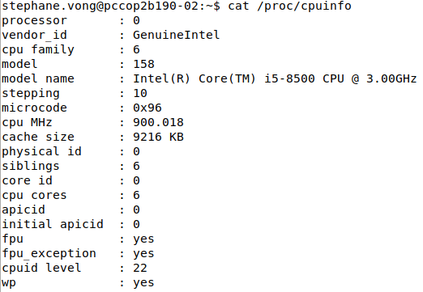
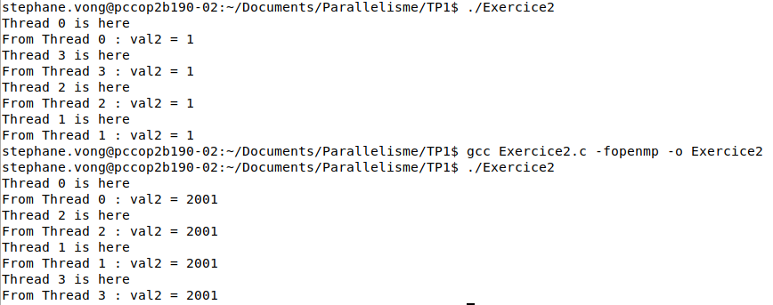
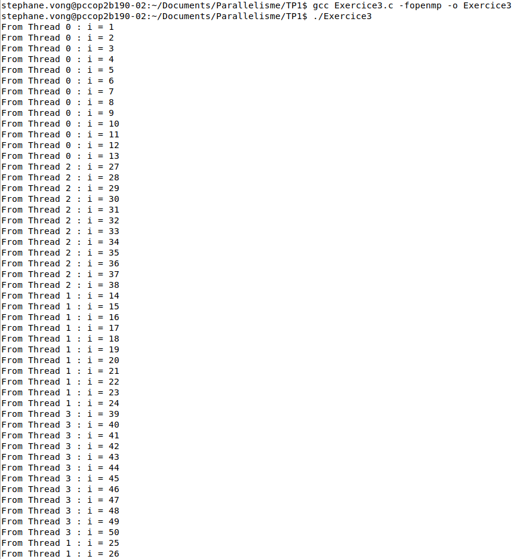
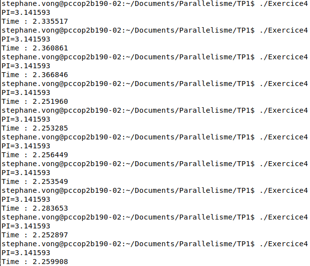
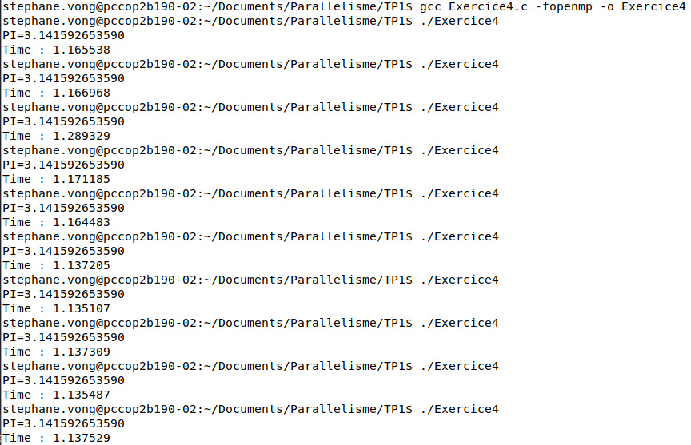
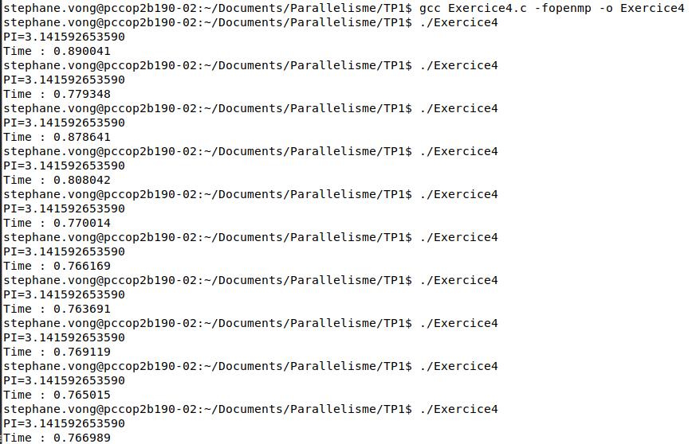
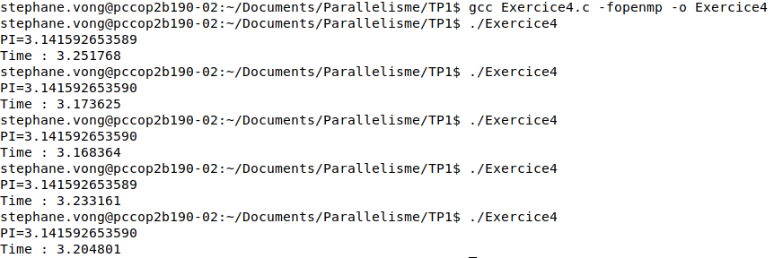
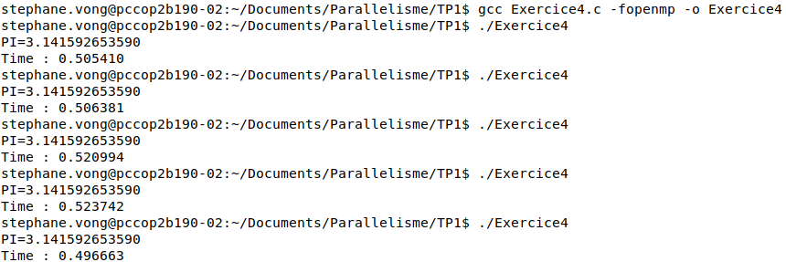

## TP1 : Parallélisme intra-processeur - OpenMP

#### Exercice 1 :

L'architecture où le TP a été réalisé compte 6 coeurs et sa fréquence d'horloge est d'environ 900 MHz.



#### Exercice 2 :

Avec le mot clé private, val2 est égale à 1
Avec le mot clé firstprivate, val2 est égale à 2001
private initie la valeur de val2 à 0 tandis que firstprivate récupère la valeur de val2 initialisé avant la boucle.



#### Exercice 3 :

```c
#include <omp.h>
#include <stdio.h>

const int OMP_NUM_THREADS = 4;

int main()
{
    omp_set_num_threads(OMP_NUM_THREADS);

    #pragma omp parallel for
    for (int i = 1; i < 51; i++)
    {
        int idThread = omp_get_thread_num();
        printf("From Thread %d : i = %d \n", idThread, i);
    }

    return 0;
}
```



#### Exercice 4 :

2.


Durée d'exécution monoprocesseur de référence :
t1 = 2.2874925

4. Il faut utiliser firstprivate sur x afin qu'il n'y ait pas de problème de partage de variable entre les threads, sans firstprivate, la valeur de PI sera faussée.
```c
#include <omp.h>
#include <stdio.h>

const int OMP_NUM_THREADS = 2;

int main()
{
    omp_set_num_threads(OMP_NUM_THREADS);

    double begin = omp_get_wtime();

    static long nb_pas = 1000000000;
    double pas = 1.0/(double) nb_pas;
    double x, pi = 0.0;
    double som = 0.0;
    int i = 0;

    #pragma omp parallel for reduction (+ : som) firstprivate (x)
    for (i = 0; i < nb_pas; i++)
    {
        x = (i + 0.5) * pas;
        som += 4.0/(1.0 + x * x);
    }
    pi = pas * som;

    double end = omp_get_wtime();

    printf("PI=%.12f\n",pi);
    printf("Time : %f \n", end - begin);

    return 0;
}
```


t3 = 1.16182017

5. SpeedUp = t_mono_thread / t_x_threads
t1/t2 = 1.96888688892

On s'attendait à ce que ce soit 2 fois plus rapide, ce qui est plus ou moins le cas dans notre cas après avoir calculé l'acccélération

6. C'est le même code que pour la 4.4, avec uniquement le nombre de thread qui change.


t3 = 0.79572899
t6 = 0.451937

7. On remarque qu'avec la stratégie d'ordonnancement dynamic, le programme est très lent par rapport à la façon static.

t6_DYNAMIC = 3.2063438

t6_STATIC = 0.510638

8. pas à faire

#### Exercice 5 :

1. Voici le code pour cette partie :
```c
#include <omp.h>
#include <stdio.h>
#include <stdlib.h>
#include <math.h>
#include <complex.h>

const int OMP_NUM_THREADS = 1;

int main()
{
    omp_set_num_threads(OMP_NUM_THREADS);

    double complex C = -0.8 + I * 0.156;

    int N = 200;
    int width = 600;
    int height = 400;

    FILE *file;
    file = fopen("out.pgm", "wb");
    fprintf(file, "P2\n");
    fprintf(file, "%d %d\n", width, height);
    fprintf(file, "255\n");

    double begin = omp_get_wtime();
    int l = width < height ? width : height;
    for (int y = 0; y < height; y++)
    {
        for (int x = 0; x < width; x++)
        {
            double normalizedX = 1.5 * (x - width / 2)/ l;
            double normalizedY = 1.5 * (y - height / 2)/ l;

            double complex Z = normalizedX + I * normalizedY;
            double complex Zi = 0;

            for (int i = 0; i < N; i++)
            {
                Zi = cpow(Z, 2) + C;
                Z = Zi;
            }
            double val = sqrt(pow(creal(Zi), 2.0) + pow(cimag(Zi), 2.0));

            fprintf(file, "%d ", (val < 200) ? 255 : 0);
            
        }
        fprintf(file, "\n");
    }
    double end = omp_get_wtime();
    printf("Time : %f \n", end - begin);
    fclose(file);

    return 0;
}
```

2. Tableau récapitulatif
```
| Nombre de threads  | Temps d'exécution  |
| ------------------ | ------------------ |
| 1                  | 5,78s              |
| 2                  | 3,25s              |
| 3                  | 2,68s              |
| 4                  | 2,21s              |

```